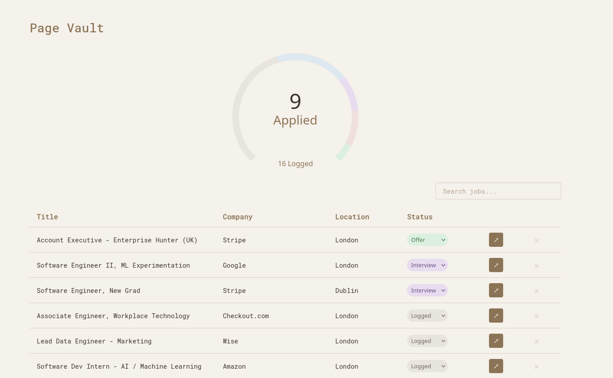

# 💼 Page Vault

A job application tracker with browser-based page capture.

## Architecture

- **[Firefox Extension](https://github.com/PaddyConnolly/page-vault-extension)** - Capture job listings with configurable hotkey
- **[Rust Server](https://github.com/PaddyConnolly/page-vault-server)** - Stores raw HTML in SQLite
- **Python/FastAPI** - Parses HTML, exposes REST API
- **React Frontend** - Displays and manages saved jobs

## Notes

Company detection and location parsing are currently hardcoded:
- Company names are extracted from URL domains (with special handling for job boards like workday)
- Locations are normalized by matching against a list of known cities

See [SUPPORTED_COMPANIES.md](SUPPORTED_COMPANIES.md) for the full list of configured companies (over 35+ tech companies currently configured).

## Status

🚧 Under construction 🚧
